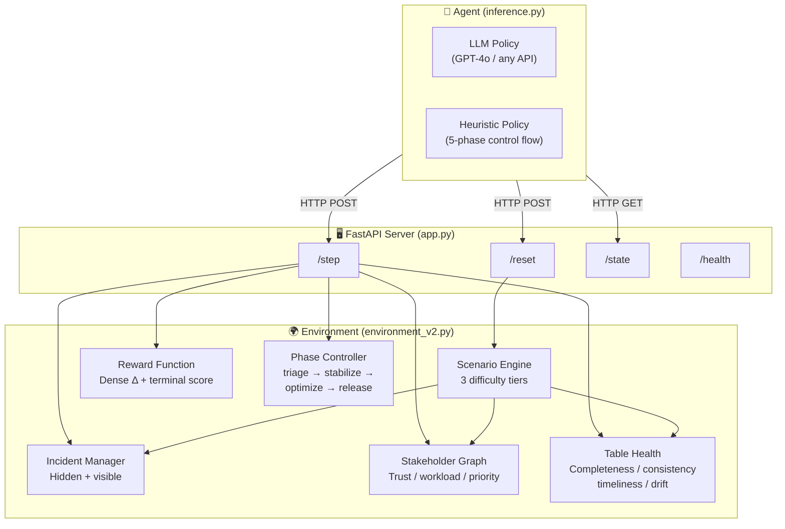
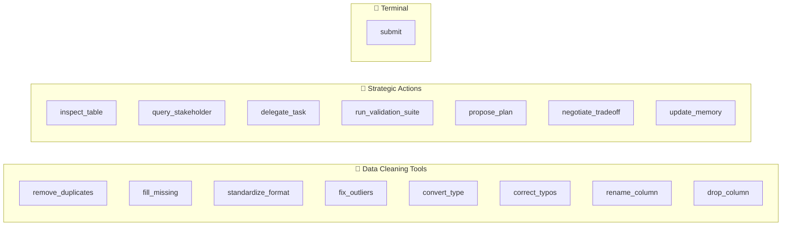

# Collaborative DataOps Crisis Environment — Architecture

## System Architecture



## Action Space (16 action types)



## Observation Space

| Component | Description | Dimension |
|-----------|-------------|-----------|
| **Table Health** | Per-table completeness, consistency, timeliness, drift | `N_tables × 4` |
| **Visible Incidents** | Discovered issues with severity, category, dependencies | Variable list |
| **Hidden Risk Hints** | Coarse signals about undiscovered risks | String list |
| **Stakeholder Status** | Trust, workload, known/unknown priority per stakeholder | `N_stakeholders × 4` |
| **Mission Score Breakdown** | 7 dimensions: integrity, alignment, compliance, confidence, plan quality, risk penalty, composite | 7 floats |
| **Memory Bank** | Agent-writable key-value memory for long-horizon state | Dict |
| **Narrative Event Log** | Recent mission events (last 8) | String list |
| **Phase** | Current mission phase (triage/stabilize/optimize/release) | Enum |

## Reward Design

```
Step Reward  = clamp(Δ_score × 1.5 − step_cost, −0.5, +0.5)
Submit Reward = final_score − 0.20 × unresolved_critical + bonus
Timeout      = score × 0.82  (auto-submit penalty)

Mission Score = 0.35 × data_integrity
             + 0.20 × stakeholder_alignment
             + 0.20 × compliance_safety
             + 0.15 × execution_confidence
             + 0.10 × efficiency
             + 0.05 × plan_quality
             − 0.05 × hidden_risk_pressure
```

## Task Scenarios

| Task | Scenario | Tables | Stakeholders | Incidents | Max Steps |
|------|----------|--------|--------------|-----------|-----------|
| `task_easy` | Retail Promo DataOps Triage | 3 | 3 | 4 (1 hidden) | 20 |
| `task_medium` | Healthcare Claims Reliability Sprint | 4 | 4 | 5 (1 hidden) | 28 |
| `task_hard` | Global Supply Chain Data Crisis | 5 | 5 | 6 (2 hidden) | 36 |

## Key Innovation: Socio-Technical War Room

Unlike flat single-table cleaning environments, this environment models **three interacting subsystems** simultaneously:

1. **Data Layer** — traditional table health metrics with incident-driven degradation
2. **Social Layer** — stakeholder trust decay, workload limits, hidden priorities that gate delegation effectiveness
3. **Mission Layer** — 4-phase progression with dynamic risk pressure, compliance escalation, and plan quality tracking

The agent must balance all three to maximize the composite mission score — cleaning data alone is insufficient without stakeholder alignment and compliance safety.
